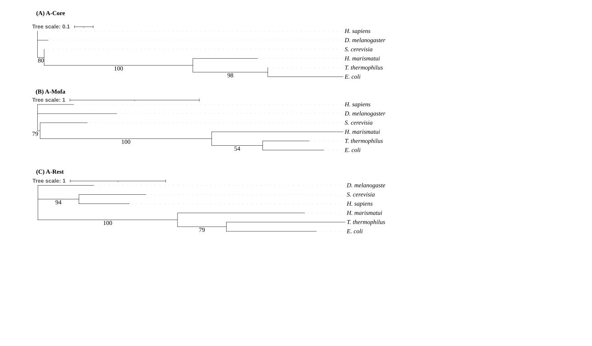

## 🌳 Evolutionary Analysis of A-helix Structural Regions

To compare evolutionary signals across different spatial regions of the large ribosomal subunit, A-core, A-mofa, and A-rest sequences were analyzed separately.

<div align="center">
  <div style="background-color: white; padding: 15px; display: inline-block;">
    
  </div>
</div>

<p align="center">
  <em>Phylogenetic trees reconstructed separately from A-core, A-mofa, and A-rest regions.</em>
</p>


# Workflow for A-helix-Based Ribosome Structural Analysis

This repository contains the MATLAB implementation used in our study of ribosome structural evolution through rRNA A-helices. The workflow computes three-dimensional centers of mass (COM) from ribosomal PDB structures, aggregates A-helix coordinates across species, performs distance-based partitioning, and fits structural distribution curves for downstream comparison.

### 🧬 Ribosome Structural Evolution
<p align="center">
  
</p>

<p align="center">
  <em>Ribosomal architecture expands revealing a structural trajectory from the center toward the periphery.</em>
</p>

<p align="center">
  
</p>

<p align="center">
  <em>rRNA A-helix spatial organization relative to the ribosomal center of mass across species and organelles.</em>
</p>

## Overview

The pipeline takes ribosomal PDB structures and helix index tables as input and performs the following steps:

1. compute chain-level COM from ribosomal PDB structures
2. compute nucleotide-level COM for all residues in each structure
3. compute helix-level COM from nucleotide coordinate ranges
4. sort and standardize helix-level output tables
5. aggregate species-level COM and distance measurements
6. partition COM distances into radial bins
7. fit structural distribution curves across species

## Dataset

The dataset used in this study is available at  [[Dataset]](https://drive.google.com/drive/folders/15ZWkeQTTzB-d7W4T_mcw_NDQwW-FLmlX?usp=sharing).

## Input Data

- Helix index tables should be placed in `input/`
- Required ribosomal PDB structures should be placed in `pdbs/`

## Repository contents

Main scripts
- `script_for_evolution_algorithm.m` – main pipeline script runs all steps end-to-end.
- `calculate_COM.m` – compute COM for a given PDB file and chain ID and save the result as a text file.
- `new_new_calculateAllCOM.m` – batch COM computation for all helices in each PDB.
- `Nucleotide_COM_species_COM_main.m` – aggregate COM information across species and compute pairwise distances.
- `partition_new.m`, – - `partition_new.m` – partition helices into distance bins for downstream analysis.

By default, the analysis uses a radial bin width of 7 Å when binning the COM distances (DCOM) from the LSU center of mass. This is the setting used to generate the main results in the manuscript.

- `fitted_curve_result_new_2.m` – perform curve fitting on the distance profiles and generate the final summary curves.
- `sort_file.m`, `new_COM_generator.m`, `main_with_function_helices_COM_main.m` – helper scripts used inside the main workflow.

Input / output files (expected by the code)

- `pdbs/` – folder containing input ribosomal PDB files, e.g.
  - `1jj2.pdb`
  - `4v6w-pdb-bundle3.pdb`
  - `4v6x-pdb-bundle3.pdb`
  - `4v9d-pdb-bundle3.pdb`
  - `4v51-pdb-bundle4.pdb`
  - `4v88-pdb-bundle2.pdb`
  - `7l20-pdb-bundle1.pdb`

- `input/` – folder containing input helix index tables


> **Note:** Please place the PDB files in the `pdbs/` folder and the Excel files in the repository root (or update the paths in the scripts accordingly).

## Requirements

- MATLAB R2019b or later
- Bioinformatics Toolbox (for the `pdbread` function)
- Optimization or Curve Fitting Toolbox for the fitting functions used in `fitted_curve_result_new_2.m`

## Quick start

1. Download or clone this repository.
2. Open MATLAB and set the current folder to the root of this repository.
3. Run the main workflow:

```matlab
script_for_evolution_algorithm
```


## 📚 Related Publications

1. **Lan, Y.-S., Hsiao, C., et al.** 
et al.**  
   [Architectural principles of the ribosomal large subunit revealed by A-helix spatial organization](https://www.nature.com/articles/s41598-026-52028-2)  
   *Scientific Reports*, 2026.  
   DOI: [10.1038/s41598-026-52028-2](https://doi.org/10.1038/s41598-026-52028-2)

2. **Lan, Y.-S. & Hsiao, C.**  
   [The RNA A-helix architects the evolution of the ribosome](https://doi.org/10.21203/rs.3.rs-6948671/v1)  
   *Research Square*, 2025.  
   DOI: [10.21203/rs.3.rs-6948671/v1](https://doi.org/10.21203/rs.3.rs-6948671/v1)

## License

This project is released under the MIT License. See the `LICENSE` file for details.

## Visualization

PyMOL scripts for structural visualization are available at: [[Here]](https://github.com/r08b46009/pymol-ribosome-visualization).
